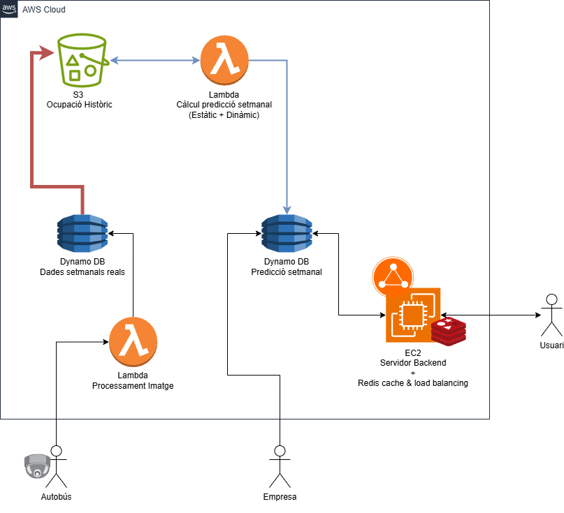

# 📌 Tarraco C-Mobility

Aquest projecte està enfocat a millorar la elasticitat del servei de transport d'autobusos urbà i a aportar transparència a l'usuari, facilitant-ne el seu ús. Implementem un sistema de detecció d'ocupació per informar de la saturació dels busos, i un algorisme de predicció d'ocupació per ajudar a l'empresa a oferir la millor cobertura.

## 👥 Equip - CloudChain

### Víctor Fosch Tena

### Joan Ignasi Cid Guardia

### Miguel Robledo Kusz

## ❓ Problema abordat

Hem detectat un descontent general als habitants de Tarragona tant amb la freqüència del servei com amb la incertesa d'aquest. 

## 💡 La nostra solució

Abordem el problema des de dos perspectives:
 - **Perspectiva de l'empresa**: oferim un sistema de comptatge de persones al autobús per detectar saturacions, implementem un algorisme de predicció d'ocupació a futur per planificar millor el  servei i oferim una arquitectura al cloud per gestionar-ho tot, pensada amb la fiabilitat, la velocitat i la escalabilitat a futur.
 - **Perspectiva de l'usuari**: oferim una aplicació web que ofereix: compra online de l'abonament de transport, mapa interactiu amb informació en temps real de l'ocupació dels busos, nombre de places lliures per persones amb mobilitat reduïda i localització dels busos. 

## 🛠️ Tecnologies utilitzades

- Llenguatges de programació: Python i JavaScript 
- Frameworks i llibreries: Pandas, prophet, matplotlib, openpyxl  
- Eines i plataformes: Docker, Excel, VSCode

## ☁️ Sistema Implementat

L'arquitecutra cloud implementada té les següents parts:
 - Un bucket S3 per guardar l'històric de dades de l'ocupació
 - Dos bases de dades Dynamo per accedir de forma ràpida a les dades de predicció setmanal i dades setmanals reals.
 - Dos funcions Lambda per calcular la predicció setmanal i per processar les imatges dels autobusos.
 - Un servidor amb una caché Redis per processar les peticions de la aplicació web de l'usuari. 

## 🌍 Impacte del projecte

Aquest projecte promociona un increment en l'ús del transport públic, generant un impacte positiu a la contaminació de la ciutat i al medi ambient. La adopció per part de l'empresa facilita la planificació cobrint la demanda inclús en casos especials.

## 📸 Captures i/o demo del projecte

**GRÀFIC DE PREDICCIÓ D'OCUPACIÓ SETMANAL**
https://drive.google.com/file/d/1TXad8ezVrT9drbAKdn6qYy_BMUir-GeS/view?usp=sharing

**DEMO APLICACIÓ WEB**
https://drive.google.com/file/d/1lW_bBHZS4_TSvfdRy1GmdJC5fVc_q_Wx/view?usp=drive_link

## 🙌 Agraïments i conclusió

Donem les gràcies a l'organització i sobretot a l'equip de Cloud de la URV que ens ha estat ajudant i aconsellant.

Projecte desenvolupat com a part de la Hackató Cloud Computing 2025, per la Universitat Rovira i Virgili i T-Systems.
